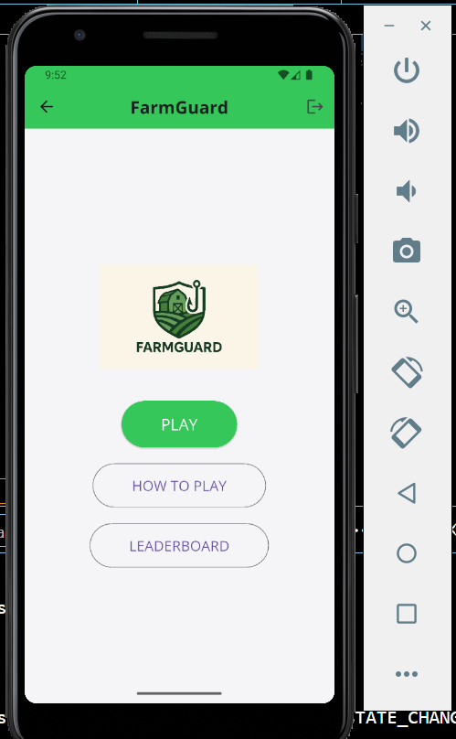

# 🛡️ FarmGuard – Phishing Awareness Game

## 📌 Overview
FarmGuard is a Flutter-based mobile cybersecurity awareness game designed to educate rural farmers about phishing scams through interactive learning scenarios. The application simulates real-world scam messages and teaches users how to identify and avoid social engineering attacks.

The goal of the project is to improve cybersecurity awareness through gamification and practical decision-making exercises.

---

## 🎯 Objectives
- Educate users on phishing and social engineering attacks
- Provide interactive scam detection scenarios
- Promote cybersecurity awareness in non-technical communities
- Demonstrate secure application design concepts

---

## 🧰 Technologies Used
- Flutter (Dart)
- Firebase Authentication
- Firebase Firestore
- Mobile UI/UX Design
- Cybersecurity Awareness Principles

---

## ⚙️ Features
- User authentication (Login & Signup)
- Interactive phishing scenarios
- Immediate feedback system
- Leaderboard tracking user performance
- Educational gameplay mechanics

---

## 🏗️ System Architecture
The application uses Firebase backend services for authentication and leaderboard storage while Flutter provides the cross-platform mobile interface.

---
## 📸 Screenshots
### Signup Screen

### Login Screen

### Home Screen

### How To Play Screen

### Scenario Screen

### Feedback Screen - Right Option

### Feedback Screen - Wrong Option

### Leaderboard Screen

